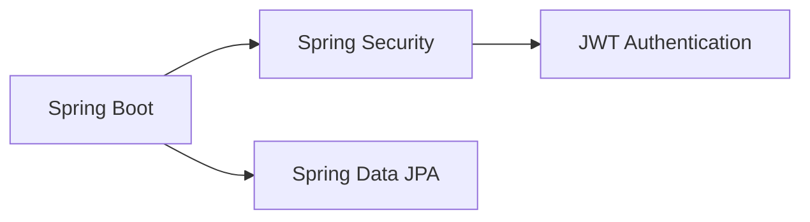

<div align="center">

# 🏢  Inventory Control System

[](https://spring.io/projects/spring-boot)
[](https://www.oracle.com/java/)
[](LICENSE)
[](https://jwt.io/)

> A robust Spring Boot application for smooth inventory management with comprehensive security, real-time tracking, and seamless integration capabilities.

[🎯 Overview](#-overview) •
[🌟 Features](#-features) •
[🛠️ Tech Stack](#-tech-stack) •
[📦 Installation](#-installation) •
[🚀 Getting Started](#-getting-started) •
[📖 Documentation](#-documentation) •
[👨‍💻 Contributing](#-contributing)

</div>

---

## 🎯 Overview

The  Inventory Control System is a comprehensive solution designed to streamline inventory management operations. Built with Spring Boot, it offers enterprise-grade security, real-time tracking, and seamless integration capabilities for various businesses.

## 🌟 Features

<table>
<tr>
<td>

### 🔐 Security & Access
- JWT-based authentication
- Role-based access control
- Secure API endpoints
- Structured error handling

</td>
<td>

### 📦 Core Functions
- Complete product CRUD operations
- Real-time inventory tracking
- Order lifecycle management
- Supplier relationship management

</td>
</tr>
<tr>
<td>

### 🔄 Data Management
- Bulk CSV import/export
- Real-time notifications
- Data validation
- Automated testing suite

</td>
<td>

### ⚡ Development
- Hot reload support
- Comprehensive logging
- Error tracking
- DevOps-ready configuration

</td>
</tr>
</table>


## 🛠️ Tech Stack

### Core Framework & Security


### Key Components
- **Database**: MySQL / PostgreSQL
- **Authentication**: JWT with Spring Security
- **Documentation**: Postman
- **Testing**: JUnit, Mockito
- **Utilities**: Lombok, ModelMapper
- **Validation**: Jakarta Validation API

## 📦 Installation

### Prerequisites
- Java 17+
- Maven 3.6+
- MySQL

### 🚀 Getting Started

1. **Clone Repository**
```bash
git clone https://github.com/sumanbisunkhe/inventory-control-system.git
cd inventory-control-system
```

2. **Configure Database**
   Create `application.properties`:
 ```properties
     spring.application.name=inventory-control-system
            
     # MySQL Database Configuration
     spring.datasource.url=jdbc:mysql://localhost:3306/inventory_control_system_db
     spring.datasource.username=your_username
     spring.datasource.password=your_password
     spring.datasource.driver-class-name=com.mysql.cj.jdbc.Driver
            
     # Hibernate JPA Configuration
     spring.jpa.hibernate.ddl-auto=update
     spring.jpa.show-sql=true
     spring.jpa.properties.hibernate.dialect=org.hibernate.dialect.MySQLDialect
            
     # Other Spring Boot Settings
     server.port=8080
     spring.jackson.serialization.WRITE_DATES_AS_TIMESTAMPS=false
            
            
     # ========== JWT Configuration ==========
     jwt.secret=0oaP4MrLeRXkmISd9HXo6Eth90udQMvCICrKbaAfqbE=
            
     # ========== Logging Configuration ==========
     logging.level.org.hibernate.SQL=DEBUG
     logging.level.org.hibernate.type.descriptor.sql.BasicBinder=TRACE
            
     # ====== Mail Configuration ======
     spring.mail.host=smtp.gmail.com
     spring.mail.port=587
     spring.mail.username=you_email
     spring.mail.password=your_email_app_password
     spring.mail.properties.mail.smtp.auth=true
     spring.mail.properties.mail.smtp.starttls.enable=true
   ```

3. **Build & Run**
```bash
mvn clean install
mvn spring-boot:run
```

## 🗂️ Project Structure

```
inventory-management-system/
│
├── src/
│   ├── main/
│   │   ├── java/
│   │   │   └── com/
│   │   │       └── example/
│   │   │           └── inventory/
│   │   │               ├── config/
│   │   │               │   └── SecurityConfig.java
│   │   │               │ 
│   │   │               ├── controller/
│   │   │               │   ├── AuthController.java
│   │   │               │   ├── CsvController.java
│   │   │               │   ├── OrderController.java
│   │   │               │   ├── ProductController.java
│   │   │               │   ├── SupplierController.java
│   │   │               │   └── UserController.java
│   │   │               │
│   │   │               ├── dto/
│   │   │               │   ├── OrderDto.java
│   │   │               │   ├── ProductDto.java
│   │   │               │   ├── SupplierDto.java
│   │   │               │   └── UserDto.java
│   │   │               │
│   │   │               ├── enums/
│   │   │               │   ├── Category.java
│   │   │               │   ├── OrderStatus.java
│   │   │               │   ├── RoleName.java
│   │   │               │   └── Status.java
│   │   │               │
│   │   │               ├── exceptions/
│   │   │               │   ├── CsvlmportException.java
│   │   │               │   ├── GlobalExceptionHandler.java
│   │   │               │   ├── JwtTokenException.java
│   │   │               │   ├── OrderNotFoundException.java
│   │   │               │   ├── ProductNotFoundException.java
│   │   │               │   └── SupplierNotFoundException.java
│   │   │               │
│   │   │               ├── model/
│   │   │               │   ├── Order.java
│   │   │               │   ├── Product.java
│   │   │               │   ├── Role.java
│   │   │               │   ├── Supplier.java
│   │   │               │   └── User.java
│   │   │               │
│   │   │               ├── repo/
│   │   │               │   ├── OrderRepo.java
│   │   │               │   ├── ProductRepo.java
│   │   │               │   ├── RoleRepo.java
│   │   │               │   ├── SupplierRepo.java
│   │   │               │   └── UserRepo.java
│   │   │               │
│   │   │               ├── security/
│   │   │               │   ├── AuthenticationRequest.java
│   │   │               │   ├── AuthenticationResponse.java
│   │   │               │   ├── JwtRequestFilter.java
│   │   │               │   └── JwtUtil.java
│   │   │               │
│   │   │               │
│   │   │               ├── service/
│   │   │               │   ├── impl/
│   │   │               │   │   ├── EmailServiceImpl.java
│   │   │               │   │   ├── OrderServiceImpl.java
│   │   │               │   │   ├── ProductServiceImpl.java
│   │   │               │   │   ├── SupplierServiceImpl.java
│   │   │               │   │   └── UserServiceImpl.java
│   │   │               │   │
│   │   │               │   ├── EmailService.java
│   │   │               │   ├── OrderService.java
│   │   │               │   ├── ProductService.java
│   │   │               │   ├── SupplierService.java
│   │   │               │   └── UserService.java
│   │   │               │   
│   │   │               ├── utils/
│   │   │               │   ├── CsvUtils.java
│   │   │               │   ├── CustomCustomerDetailsService.java
│   │   │               │   ├── CustomEmailMessage.java
│   │   │               │   ├── Databaselnitializer.java
│   │   │               │   ├── KeyGenerator.java
│   │   │               │   └── Rolelnitializer
│   │   │               │ 
│   │   │               └── InventoryManagementSystemApplication.java
│   │   └── resources/
│   │       ├── docs/
│   │       │   └── Inventory Control System API Documentation.pdf
│   │       └── application.properties
│   │       
│   └── test/
│       └── java/
│           └── com/
│               └── example/
│                   └── inventory/
│                       ├── controller/
│                       │   ├── AuthControllerTest.java
│                       │   ├── CsvControllerTest.java
│                       │   ├── OrderControllerTest.java
│                       │   ├── ProductControllerTest.java
│                       │   ├── SupplierControllerTest.java
│                       │   └── UserControllerTest.java
│                       │ 
│                       ├── service/
│                       │   ├── EmailServicelmplTest.java
│                       │   ├── OrderServicelmplTest.java
│                       │   ├── ProductServicelmplTest.java
│                       │   ├── SupplierServicelmplTest.java
│                       │   └── UserServicelmplTest.java   
│                       │
│                       └── InventoryManagementSystemApplicationTests.java
│   
│   
├── LICENSE  
├── mvnw  
├── mvnw.cmd  
├── pom.xml
└── README.md
```

## 🔧 Core Dependencies

<table>
<tr><th>Category</th><th>Dependencies</th></tr>
<tr>
<td>Core</td>
<td>

- spring-boot-starter-web
- spring-boot-starter-data-jpa
- spring-boot-starter-security

</td>
</tr>
<tr>
<td>Security</td>
<td>

- jjwt-api
- jjwt-impl
- jjwt-jackson

</td>
</tr>
<tr>
<td>Database</td>
<td>

- mysql-connector-j
- postgresql

</td>
</tr>
<tr>
<td>Utilities</td>
<td>

- lombok
- modelmapper
- commons-csv

</td>
</tr>
</table>

## 📖 Documentation

<div align="center">

### 📚 Available Documentation Formats

| Format                                                                                             | Description                                         | Link                                                                                                                     |
|----------------------------------------------------------------------------------------------------|-----------------------------------------------------|--------------------------------------------------------------------------------------------------------------------------|
|          | Comprehensive system architecture and API reference | <a href="src/main/resources/docs/Inventory%20Control%20System%20API%20Documentation.pdf" target="_blank">View in PDF</a> |
|  | Interactive API documentation with examples         | <a href="https://documenter.getpostman.com/view/32179535/2sAYBSkYmW#intro" target="_blank">View in Postman</a>           |

</div>

## 🤝 Contributing

Contributions are welcome! Please feel free to submit a Pull Request.

1. Fork the repository
2. Create your feature branch (`git checkout -b feature/AmazingFeature`)
3. Commit your changes (`git commit -m 'Add some AmazingFeature'`)
4. Push to the branch (`git push origin feature/AmazingFeature`)
5. Open a Pull Request

## 👨‍💻 Author


<div align="center">
  

### Suman Bisunkhe
Java Developer

[](https://github.com/sumanbisunkhe)
[](mailto:sumanbisunkhe304@gmail.com)
</div>

## 📄 License

This project is licensed under the Apache License 2.0 - see the [LICENSE](LICENSE) file for details.

---

<div align="center">

Made with ❤️ by [Suman Bisunkhe](https://github.com/sumanbisunkhe)

</div>